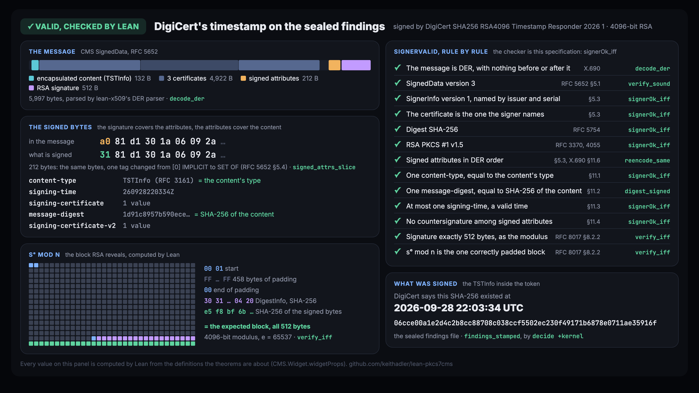

# PKCS #7 and CMS signatures, checked by Lean

Lean's kernel verifies CMS signatures (RFC 5652, the format behind PKCS #7, S/MIME, Authenticode, PDF
signatures, signed kernel modules and RFC 3161 timestamps), from the raw DER bytes to the RSA arithmetic.
The checker is proved equal to a plain statement of RFC 5652's signing rules.

    Lean's kernel, on a timestamp token from DigiCert's public timestamp server:

      signed by   DigiCert SHA256 RSA4096 Timestamp Responder 2026 1
      stamps      SHA-256 of test/pki/msg.txt
      at          2026-09-28 21:43:25 UTC

`CMS/Real.lean` states that, and Lean's kernel proves it by `decide +kernel`: it parses 5,998 bytes of DER,
hashes the signed `TSTInfo` and the signed attributes with SHA-256, raises the 4096-bit RSA signature to the public exponent,
compares it with the one correctly padded block, and reads the `TSTInfo` that was signed. No compiled code
is involved, and [Tenet](https://github.com/keithadler/tenet), an independent implementation of Lean's
kernel, checks the same proofs again.

As far as I could find, no one has formalized CMS or PKCS #7 before. The nearest work is on the layer
underneath: [ASN1*](https://www.microsoft.com/en-us/research/publication/asn1-provably-correct-non-malleable-parsing-for-asn-1-der/)
(F\*) proves DER parsing non-malleable, and ARMOR (Agda), Verdict (Verus) and
[lean-x509](https://github.com/keithadler/lean-x509) verify X.509 certificates. This project is built on
lean-x509: its DER parser, SHA-256, RSA and certificate reader.



`CMS/Widget.lean` draws one verification, the timestamp on the sealed findings, from data Lean computes:
the DER layout, the signed-attribute tag swap, the 512-byte block RSA reveals, and each rule of `SignerValid`
with the theorem behind it. Put the cursor on its `#widget` line in Lean Studio, or open `docs/index.html`
(serve `docs/` over HTTP; `scripts/Props.lean` writes the data).

## Seven verifiers, one message each flaw

`test/crosscheck` builds CMS messages byte by byte, each with exactly one thing wrong and a correct RSA
signature, and runs them through every CMS verifier on the machine. A verifier that accepts one has
accepted that flaw. The full table is in [test/crosscheck/RESULTS.md](test/crosscheck/RESULTS.md).

| Message | What happens |
|---|---|
| One detached signature whose signed attributes carry the SHA-256 of two documents, "Pay Alice $10." and "Pay Mallory $10,000." | **GnuTLS accepts the signature as valid for both documents.** RFC 5652 §11.2 allows one message-digest attribute; every other verifier refuses. |
| A message signed normally, then its content type (`eContentType`, which the signature does not cover) changed by one byte, with no key | **OpenSSL, LibreSSL and .NET still accept it** and report the new type. RFC 5652 §11.1 requires the signed content-type attribute to match `eContentType`; that attribute is the only thing that authenticates it. OpenSSL writes the attribute when signing but never compares it when verifying. The same three accept a content-type attribute naming a timestamp (`TSTInfo`) on plain data, and the reverse. |
| The signed attributes out of DER order | **The verifiers split two ways.** Signed over the bytes as written: OpenSSL, LibreSSL, Java, .NET and Apple accept, GnuTLS refuses. Signed over the sorted encoding: GnuTLS and .NET accept, the rest refuse. The same file is valid to one verifier and forged to another. |
| No content-type attribute | LibreSSL, GnuTLS and .NET accept (RFC 5652 §5.3 requires it). |
| A countersignature among the signed attributes | LibreSSL, GnuTLS, .NET and Apple accept (§11.4 forbids it). |
| No signed attributes, and the content is not plain data | OpenSSL, LibreSSL, GnuTLS and .NET accept (§5.3 requires signed attributes then). |
| An RSA signature one byte shorter than the modulus, its leading zero dropped | .NET and Apple accept (RFC 8017 §8.2.2 requires exactly the modulus length), so one signature has two encodings. |
| A byte after the end of the message | OpenSSL, LibreSSL, Java, .NET and Apple accept. |
| A signer named by subject key identifier, a control that every verifier should accept | Java's `sun.security.pkcs.PKCS7`, which verifies signed JARs, cannot parse it, although RFC 5652 §5.3 requires verifiers to support it. |

Reported: the content-type check to [OpenSSL](https://github.com/openssl/openssl/issues/33022),
[LibreSSL](https://github.com/libressl/portable/issues/1412) and [.NET](https://github.com/dotnet/runtime/issues/134822).
We judged it low severity, since it needs an application that acts on the content type after verifying, so
it was reported in public. The findings were sealed and timestamped before that; see
[lean-pkcs7cms-disclosure](https://github.com/keithadler/lean-pkcs7cms-disclosure).

Every one of these is refused by this project, and the reason is a theorem, not a test: the rules are the
specification `SignerValid`, and `signerOk_iff` proves the checker is exactly that specification.

## What is proved

| Theorem | What it says |
|---|---|
| `signerOk_iff` | The checker accepts a signer exactly when `SignerValid` holds: version and identifier agree, SHA-256 with RSA, and either no signed attributes (then the content must be plain data) or signed attributes that meet `AttrsOk`: in DER order, one `content-type` whose value is the content's type, one `message-digest` whose value is the content's SHA-256, at most one valid `signing-time`, no countersignature. And the RSA signature is exactly the modulus length and verifies over the signed bytes. |
| `verify_sound` | A message `verify` accepts is DER, has the right version, has at least one signer, and every signer is valid with a certificate the message carries or the caller supplied. |
| `signed_attrs_slice` | The bytes checked for signed attributes are a slice of the message with one byte changed: the tag `0xA0` becomes the `SET OF` tag `0x31` (RFC 5652 §5.4). Not a re-encoding, not a reordering. |
| `reencode_same` | For an accepted signer, sorting the signed attributes (as a DER re-encoder does) changes nothing, so the verifiers that split above cannot disagree about a message this project accepts. |
| `digest_signed` | With signed attributes, the content's SHA-256 is among the signed bytes, in the one `message-digest` attribute. |
| `no_attrs_data` | Without signed attributes, the content is plain data and the signature is over the content itself. |
| `decode_der` | An accepted message is exactly the DER encoding of the tree it was read as, so no second byte string reads as the same message (lean-x509's `der_unique`). |
| `verifyStamp_sound` | A timestamp token `verifyStamp` accepts is a valid CMS message, and what it reports is the `TSTInfo` that was signed. |
| `attached_valid`, `detached_valid`, `noattr_valid` | Real messages from OpenSSL verify, checked by the kernel. |
| `detached_tampered`, `detached_needs_content` | Change one byte of the content and the signature fails; a detached signature with no content is not valid. |
| `findings_stamped` | DigiCert's timestamp token for the SHA-256 of the sealed findings file (in [lean-pkcs7cms-disclosure](https://github.com/keithadler/lean-pkcs7cms-disclosure)) verifies and dates it 2026-09-28 22:03:34 UTC. |
| `digicert_stamps_msg` | DigiCert's real timestamp token verifies and stamps the SHA-256 of the test message at 2026-09-28 21:43:25 UTC. |

`test/Axioms.lean` prints the axioms of each: Lean's three standard axioms at most, no `sorry`, no
`native_decide`. Tenet re-checks all 383 declarations: 383 checked, 0 failed.

## What is not covered

- **Only DER.** RFC 5652 allows BER outside the signed attributes, including indefinite lengths, and every
  other verifier here reads it. This project refuses it for now.
- **Only SHA-256 and RSA PKCS #1 v1.5**, the algorithms lean-x509 implements. No SHA-1, SHA-384, RSA-PSS or
  ECDSA yet.
- **Only SignedData.** Not EnvelopedData, AuthenticatedData or the other content types.
- **The signature, not trust.** A valid signer is one whose certificate's key verifies the signature. Whether
  to trust that certificate (a chain to a root, key usage, validity at signing time) is left to the caller;
  lean-x509's chain validation is written for TLS servers.
- **SHA-256 itself.** The theorems say the content's SHA-256 is signed; that this pins down the content
  assumes SHA-256 has no collisions, which no proof can supply.

## Running

You need [elan](https://github.com/leanprover/elan); the toolchain is pinned in `lean-toolchain`.

```bash
lake build
```

Verify a message (JSON out; the same code the proofs are about, compiled):

```bash
.lake/build/bin/cms verify message.der --content file --cert signer.der
```

Run the cross-library table (needs `cryptography`; uses whichever of OpenSSL, LibreSSL, GnuTLS, OpenJDK,
.NET and Apple's Security framework are installed):

```bash
python3 test/crosscheck/run.py
```

## Images

Cards for posts, with the post text, are in [docs/x](docs/x): the verification above
([x-card-0-lean-proof.png](docs/x/x-card-0-lean-proof.png)), the seven-verifier table
([x-card-1.png](docs/x/x-card-1.png)), and the sealed findings with DigiCert's timestamp
([x-card-2.png](docs/x/x-card-2.png)). Their sources are `docs/x.html` and `docs/x/src/`.

## Layout

| Path | What it is |
|---|---|
| `CMS/Signed.lean` | The structures, the decoder, the specification `SignerValid`, the checker, and the theorems |
| `CMS/Slice.lean` | `signed_attrs_slice`: the signed bytes are in the message |
| `CMS/Timestamp.lean` | RFC 3161 timestamp tokens |
| `CMS/Real.lean`, `CMS/Data.lean` | Real messages, checked by the kernel (`scripts/embed.py` writes `Data.lean`) |
| `CMS/Widget.lean`, `widget/CMS.js` | The widget: one verification, drawn from data Lean computes |
| `docs/` | The widget as a standalone page (`index.html`, data from `scripts/Props.lean`) and the cards for posts |
| `test/crosscheck/` | The one-flaw corpus and the drivers for the other verifiers |
| `test/pki`, `test/real` | The test messages, and DigiCert's token |

## License

MIT. Created by Keith Adler, [@keithadler](https://x.com/keithadler) on X.
